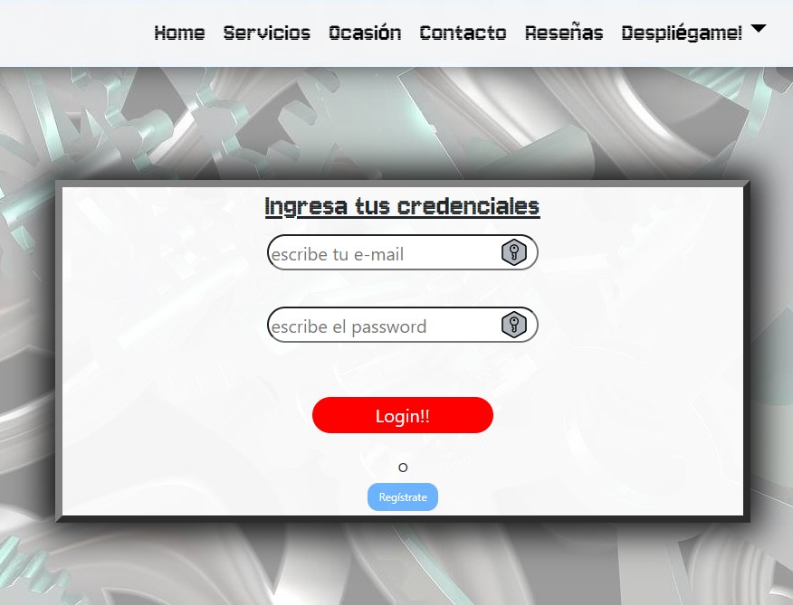
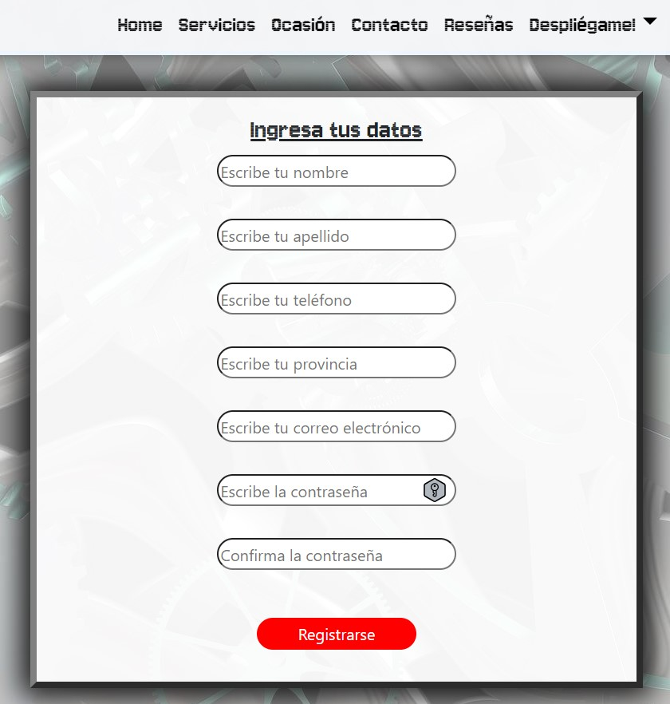
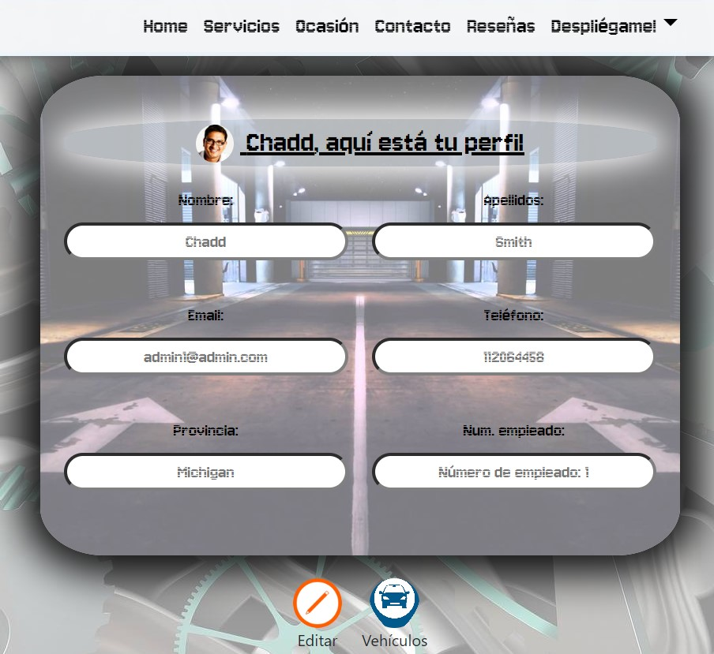
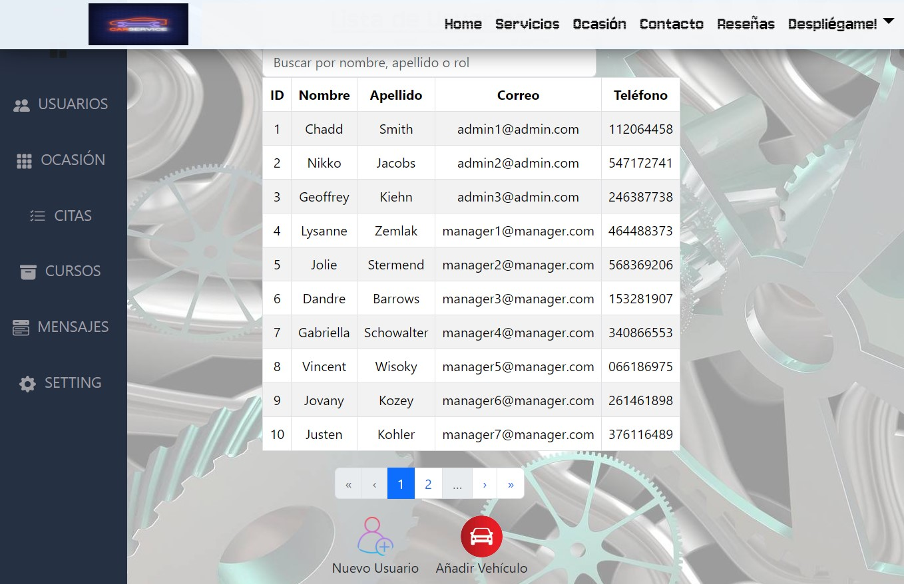
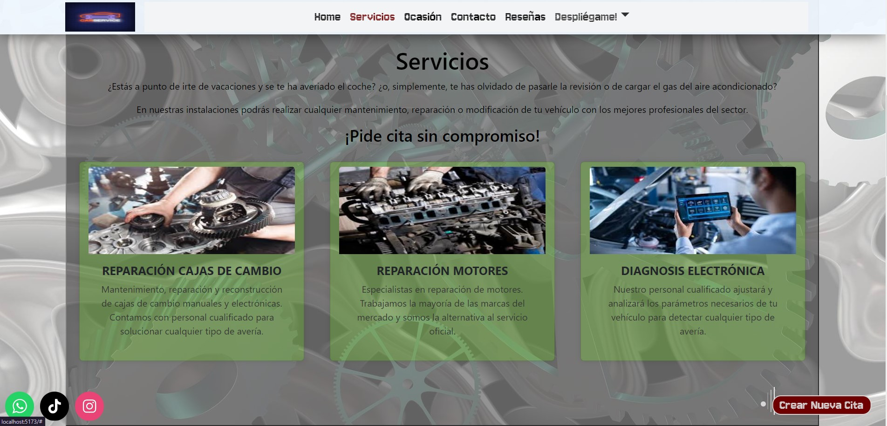
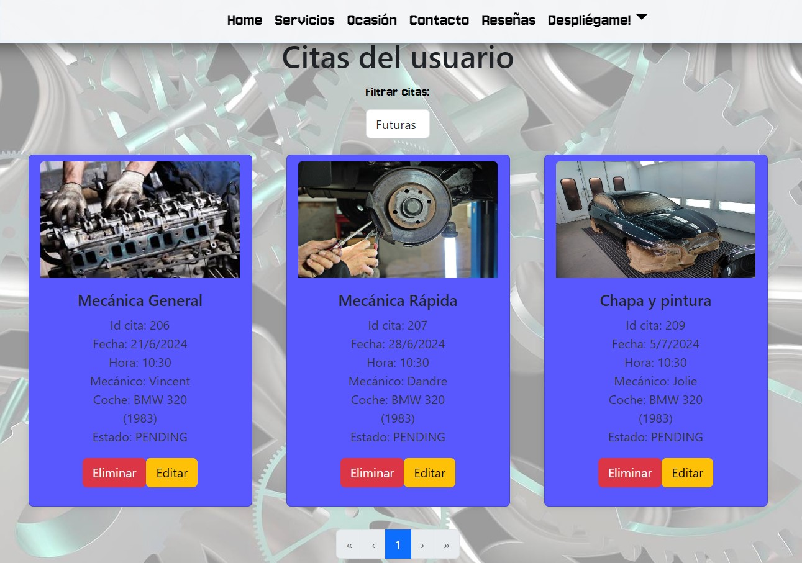

[](https://github.com/Akshay090/svg-banners)

<H4 align="center">🚘TALLER DE VEHÍCULOS🚘</H4> 

<H6 align="center">Proyecto Final del Bootcamp Full Stack Developer de Geekshubs Academy</H6>

## Descripción 🚀 

Recrea la parte frontend para la gestión de un taller de vehiculos, con gestión de usuarios, citas y vehículos. En la aplicación los usuarios pueden registrarse, iniciar sesión, acceder y editar su perfil personal, crear, editar y eliminar citas, añadir y eliminar vehículos. Como perfil de trabajador se puede ver las citas que tiene agendadas y con qué cliente. También hay un panel de administrador, en el cual se tiene la capacidad de crear, editar y borrar usuarios o citas, y añadir vehículos a los usuarios.

## Tecnologías Utilizadas 🛠️ 

[]()
[]()
[]()
[]()
[]()


##  Funcionalidades 🎯

- **Registro de usuarios**: Permite a los nuevos usuarios crear una cuenta.
- **Login**: Los usuarios pueden iniciar sesión en su cuenta.
- **Área de cliente**: Acceso a un panel de usuario donde pueden gestionar sus citas y vehículos.
- **Área de trabajador**: Acceso a un panel de usuario donde pueden gestionar sus citas concertadas y ver usuarios.
- **Gestión de citas**: Los clientes pueden programar, modificar y cancelar citas.
- **Funcionalidades de administrador**:
  - **Gestión de usuarios**: Permite ver, editar y eliminar usuarios.
  - **Gestión de citas**: Permite ver y modificar citas programadas.
  - **Gestión de vehículos**: Permite añadir vehículos a un usuario.

##  Instrucciones de uso ⚙️

1. **Clonar el repositorio**:
   ```git clone  ```
   [Repo](https://github.com/Kurtko10/taller-front)
2. **Instalar dependencias**: 
    ``` npm instal ```
3. **Inicial la aplicación**
   ``` $ npm run dev ```

### Backend 📮

  -  [Repo backend](https://github.com/Kurtko10/taller-back)


### Acceso a la aplicación 📥

- Usuarios y trabajadores: Registrarse y luego iniciar sesión para acceder a su área.
- Administradores: Iniciar sesión con credenciales de administrador para acceder a las funcionalidades administrativas.

### Capturas de pantalla de la aplicación 📷

- Login
📸 
- Registro
📸 
- Perfil de usuario
📸 
- Panel de Administrador
📸 
- Home
📸 
- Gestión de Citas
📸 

##  Mejoras 🌟

- Mejorar avisos de errores.
- Permitir al usuario cambiar su avatar.
- Formulario de contacto.
- Sistema real de reseñas y valoraciones.
- Añadir una tienda con carro de compra.
- Mejora de la interfaz de usuario.

##  Contribuciones 📧
¡Las contribuciones son bienvenidas!

## Licencia ⚖️
   Proyecto bajo la Licencia MIT. LICENSE

